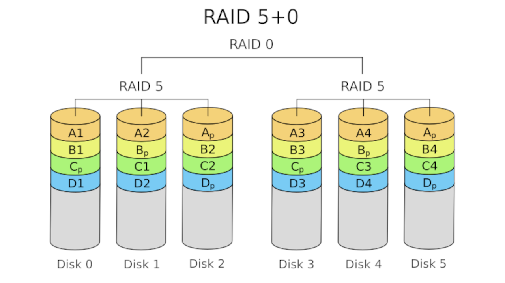

## Overview
RAID is a powerful solution to data redundancy and performance
improvement for disks, which allows us to create a pool of
storage devices to ensure fault tolerance, improve I/O operations
or unify their capacity into a single logical volume. In this article,
you'll learn how to configure RAID from scratch on your Linux server
using the `mdadm` tool. We'll also cover the different types of RAIDs 
and the use case for each one.

## Requirements
For this guide, you should have installed the `mdadm` package,
which provides the utilities for working with RAID on Linux.

On Debian/Ubuntu, the command to install it is:
```shell
sudo apt install mdadm
```

Or on Fedora/RHEL based environment, the command is:
```
sudo dnf install mdadm
```

## What is RAID?
RAID (Redundant Array of Independent Disks) is a technology that
combines multiple physical storage devices into a single unit,
with the goal to improve data redundancy (to prevent data loss)
and to improve the performance of read/write operations. RAID
can be done both via software or hardware, but hardware RAID is 
beyond the scope of this guide.

## Levels
There are different "levels" or configurations of RAID, with each one
offering distinct benefits. The most commonly used are RAID 0, 1,
5 and 6.

### RAID 0 (Striping)
This level focuses entirely on improving performance. The data is 
split into "stripes" which are distributed equally across all the disks.
This improves both the read and write speeds, since operations can
be done in parallel. The main drawback of this level is that, if one
disk is damaged/corrupted, all the information will be lost. It's mainly
used when data loss is not a big concern.


### RAID 1 (Mirroring)
This configuration ensures data redundancy, preventing data loss. It
works duplicating the data on all the drives, so if one of the disks
fail there's an exact copy of the file on the other drives. This improves
read performance, since data can be read in parallel. The principal 
disadvantage of RAID 1 is that the storage capacity is limited to the
capacity of a single disk. Also, the write speed might be slower. It's 
the best for critical systems where the data must be secured and available
at any moment.


### RAID 5 (Striping with distributed parity)
Just like RAID 0, this level splits the data across all the disks,
but it adds the concept of a "parity block", a checksum that makes
it possible to reconstruct the original data in case a disk fails.
It offers a good balance of performance, redundancy and capacity,
since data can be read/written in parallel, it has a fault tolerance
mechanism and the total capacity is (N-1) disks where N is the 
amount of disks we are using. The downside of this level is that 
the write speed is considerably slower, since the CPU needs to calculate 
the parity blocks. It's best suited for general
purpose servers, where balance is preferred.


### RAID 6 (Striping with double distributed parity)
It's an extended version of RAID 5 which adds a parity block
making it able to withstand the failure of two storage devices
simultaneously without losing data. The write speed gets even 
slower than with RAID 5. The total capacity will be (N-2),
so we'll be losing the capacity of two disks.


## Creating a RAID
Now it's time to learn how to actually create a RAID. 
First of all, we have to identify the name of the disks
we want to be part of the array. In my case, I have four
virtual disks:

```shell
myuser@deb-homelab:~# lsblk
NAME                        MAJ:MIN RM  SIZE RO TYPE MOUNTPOINTS
vda                         254:0    0    5G  0 disk 
vdb                         254:16   0    5G  0 disk 
vdc                         254:32   0    5G  0 disk 
vdd                         254:48   0    5G  0 disk 
```

If I want to make a RAID 0 using `vda` and `vdb`, I should
run:

```shell
root@deb-homelab:~# mdadm --create /dev/md/myraid0 --level=0 --raid-devices=2 /dev/vda /dev/vdb 
mdadm: Defaulting to version 1.2 metadata
mdadm: array /dev/md/myraid0 started.
root@deb-homelab:~#
```
- `mdadm`: is the RAID software for Linux.
- `--create`: this tells `mdadm` that we want to create a RAID.
- `/dev/md/myraid0`: is the name we are giving to this new array.
Make sure it starts with `/dev/md`.
- `--level=0`: sets the level of the RAID. In this case we want to 
generate a RAID 0.
- `--raid-devices=2`: how much disks we'll use in the array.
- `/dev/vda /dev/vdb`: the disks to use in the RAID.

We can verify our RAID was successfully created running:

```shell
root@deb-homelab:~# cat /proc/mdstat 
Personalities : [raid0] 
md127 : active raid0 vdc[1] vdb[0]
      10475520 blocks super 1.2 512k chunks
      
unused devices: <none>
root@deb-homelab:~#
```

Now, let's create a RAID 5! First I'll do will be 
to delete the RAID we've just made:

```shell
root@deb-homelab:~# mdadm --stop /dev/md/myraid0 
mdadm: stopped /dev/md/myraid0
root@deb-homelab:~#
```

A good practice would be to also delete the RAID superblocks
from those devices, to prevent the operating system from
thinking they are part of a RAID.

```shell
root@deb-homelab:~# mdadm --zero-superblock /dev/vdb /dev/vdc 
root@deb-homelab:~#
```

And now, to create the RAID 5, all we have to do is to change
the `--level` flag to `5`:

```shell
root@deb-homelab:~# mdadm --create /dev/md/myraid5 --level=5 --raid-devices=4 /dev/vdb /dev/vdc /dev/vdd /dev/vde 
mdadm: Defaulting to version 1.2 metadata
mdadm: array /dev/md/myraid5 started.
root@deb-homelab:~# apt install htop
Reading package lists... Done
root@deb-homelab:~# cat /proc/mdstat 
Personalities : [raid0] [raid6] [raid5] [raid4] 
md127 : active raid5 vde[4] vdd[2] vdc[1] vdb[0]
      15713280 blocks super 1.2 level 5, 512k chunk, algorithm 2 [4/4] [UUUU]
      
unused devices: <none>
root@deb-homelab:~# 
```

## Nested RAID
A nested RAID is a configuration where two or more RAID
levels are combined to achieve a better balance or 
performance than what a single RAID could offer. 
In essence, a nested RAID could be interpreted as a 
"RAID of RAIDs". A common example of this is RAID 10 (1+0),
which strips the data across mirrored pairs of disks,
giving us the write speed boost of RAID 0, while also 
the fault tolerance of RAID 1, since the data is mirrored.


RAID 50 (5+0) is another nested RAID configuration,
which divides the data through an array of RAID 5s,
combining the inherit speed boost of RAID 0, with the 
space-efficient fault tolerance of distributed parity.
This configuration in particular resists the failure 
of one disk per RAID 5 in the array.



## Creating a nested RAID
We can build a nested RAID just by changing the storage devices
we pass to `mdadm --create` with RAID devices. For example, to 
create a RAID 10, I'll first create two RAID 1s, and then I'll 
make a RAID 0 passing those RAIDs as arguments:

```shell
root@deb-homelab:~# mdadm --create /dev/md/raid1a --level=1 --raid-devices=2 /dev/vdb /dev/vdc
mdadm: array /dev/md/raid1a started.
root@deb-homelab:~# mdadm --create /dev/md/raid1b --level=1 --raid-devices=2 /dev/vdd /dev/vde
mdadm: array /dev/md/raid1b started.
root@deb-homelab:~# mdadm --create /dev/md/raid10 --level=0 --raid-devices=2 /dev/md/raid1a /dev/md/raid1b
mdadm: Defaulting to version 1.2 metadata
mdadm: array /dev/md/raid10 started.
root@deb-homelab:~# 
```

Now if we see the contents of `/proc/mdstat`, we'll notice there
are three devices, and one of them is made of the other two RAIDs:

```shell
root@deb-homelab:~# cat /proc/mdstat 
Personalities : [raid6] [raid5] [raid4] [linear] [multipath] [raid0] [raid1] [raid10] 
md125 : active raid0 md126[1] md127[0]
      10465280 blocks super 1.2 512k chunks
      
md126 : active raid1 vde[1] vdd[0]
      5237760 blocks super 1.2 [2/2] [UU]
      
md127 : active raid1 vdc[1] vdb[0]
      5237760 blocks super 1.2 [2/2] [UU]
      
unused devices: <none>
root@deb-homelab:~#
```

The same would apply for any other kind of nested RAID. For 
instance, to create a RAID 51 we'll do:

```shell
root@deb-homelab:~# mdadm --create /dev/md/raid5a --level=5 --raid-devices=3 /dev/vdb /dev/vdc /dev/vdd
mdadm: array /dev/md/raid5a started.
root@deb-homelab:~# mdadm --create /dev/md/raid5b --level=5 --raid-devices=3 /dev/vde /dev/vdf /dev/vdg
mdadm: array /dev/md/raid5b started.
root@deb-homelab:~# mdadm --create /dev/md/raid51 --level=1 --raid-devices=2 /dev/md/raid5a /dev/md/raid5b
mdadm: array /dev/md/raid51 started.
```

## Conclusion
This guide explains the fundamental ideas behind RAID
and how to create your own using Linux and `mdadm`. If
you find this page useful, feel free to share it with
someone else. Have a nice day!
